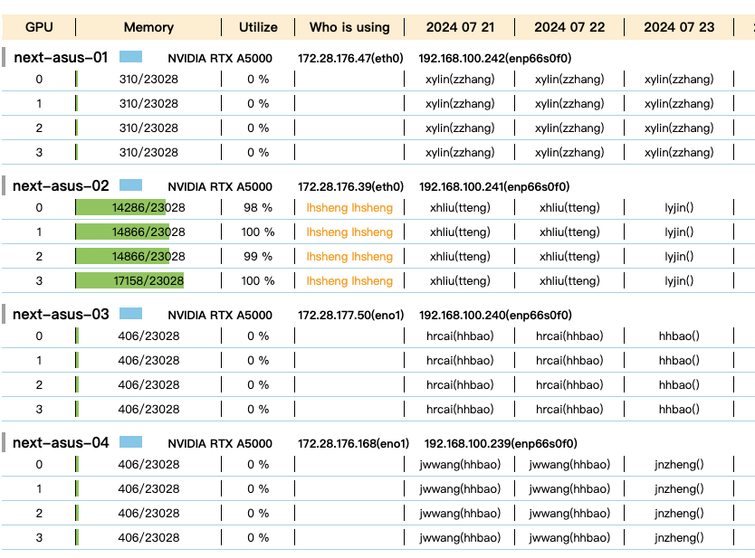

# Introduction

This project is to provide a web application to display the status of a GPU cluster and optional booking information with the help of [teamup](https://www.teamup.com/), as shwon below.

<center>

<br>
<div style="color:orange; border-bottom: 1px solid #d9d9d9;
    display: inline-block;
    color: #eee;
    padding: 2px;">Figure 1. Framework</div>
</center>

The main idea is that:
- On each node, a daemon process periodically update the node status information and expose its status via REST API.
- On the main node, a daemon process periodically collect the status of all nodes, aggregate them and provide the whole status via REST API.

# Usage
We first show the function of some main components in Section [Debug](#debug), then introduce how to deploy the monitor system ([Deploy](#deploy)).

## Debug
### Client 
The client daemons that run on each node is to periodically collect and aggregate client status information. To view the client status in `JSON`, run 
```Bash
python -m next_cluster.client.client_daemon
```

### Teamup
If you already create a teamup calendar with url `https://teamup.com/<teamup_id>`, run this command to show teamup bookings in `pandas.Dataframe` format:
```Bash
python -m next_cluster.utils.teamup <teamup_id>
```

### Main
The main daemon is to periodically collect node status and booking calendar and aggregrate them into dict. You can visualize the whole status dict with
```Bash
python -m next_cluster.main.main_daemon --passwd next
```
**Note**: This command is just for illustration. To make it run correctly, you have to modify some config in scripts. **Recommand skip this part** and go to **Deploy**.

## Deploy
The default config file is `config.toml` that enables the calendar function. Another one is `config_simple.toml` that only enable the function of displaying GPU information without calendar bookings.

**On each node**, run
```Bash
python -m next_cluster.client.cli_flask
```
to start a flask app to provide node status via port 7080 by default.

**Before start the main flask app**, modify the `host_data` in `config.toml` to include all nodes ip addresses and hostnames.

**On the main node**, run
```Bash
python -m next_cluster.main.main_flask
```

If you want to deploy the basic function and exclude *teamup* calendar, run
```Bash
python -m next_cluster.main.main_flask -c config_simple.toml
```
The default web port is 7070. Assume the `main_flask` is deployed on server with IP `192.168.0.3`, view the web application in chrome with `http://192.168.0.3:7070`